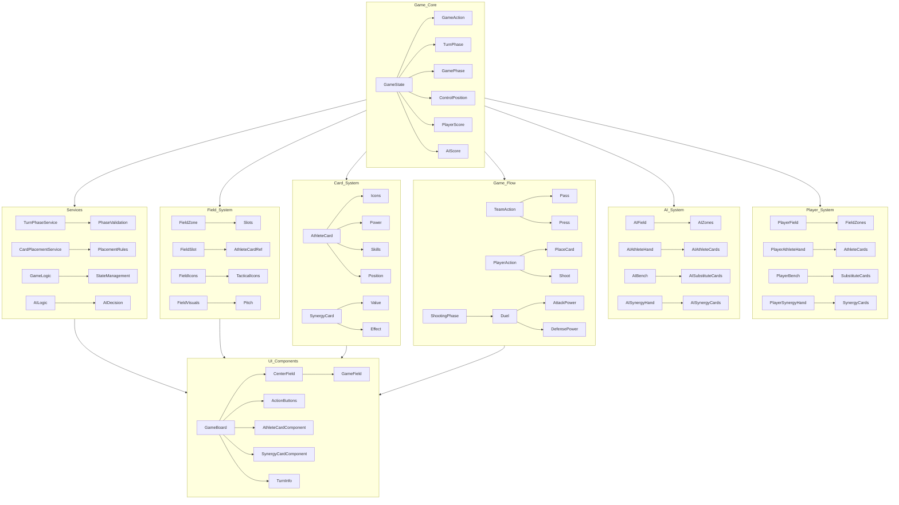
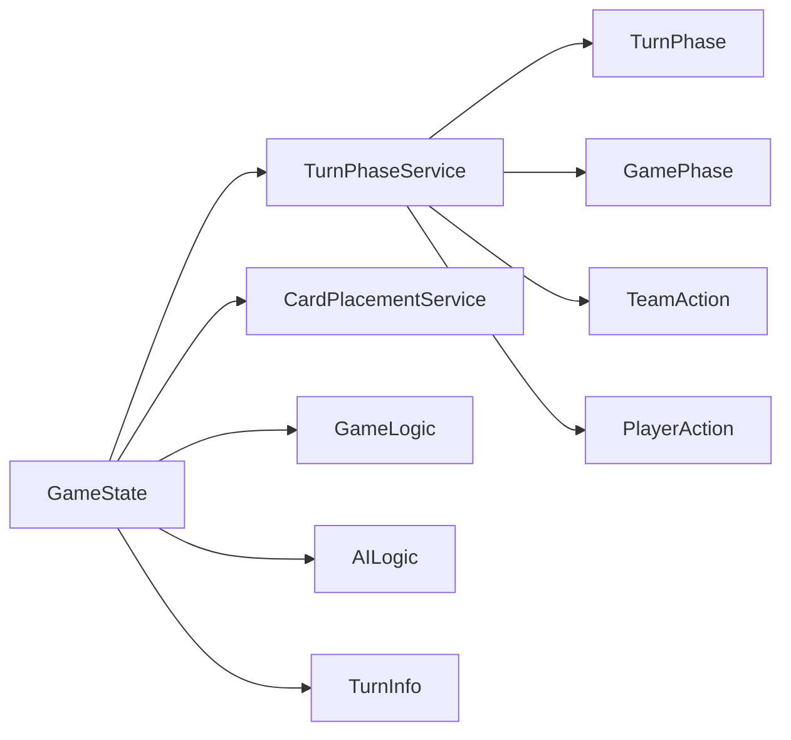
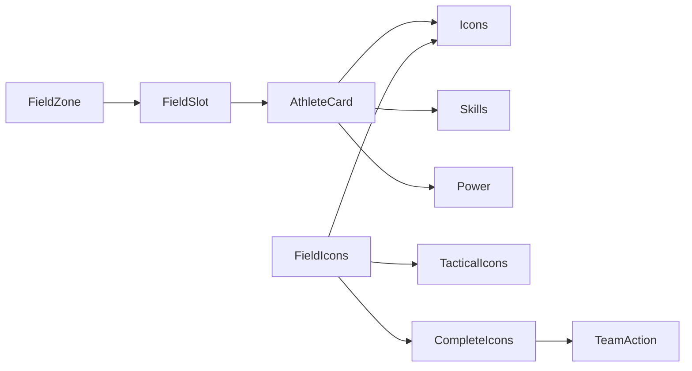
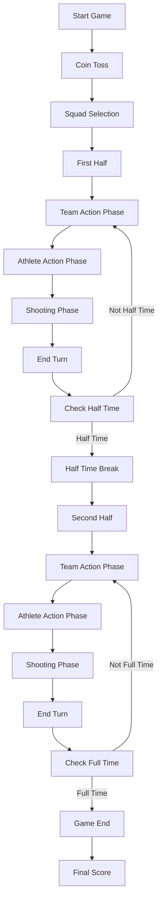
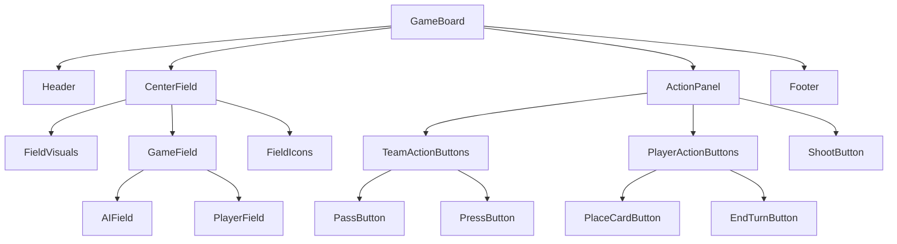
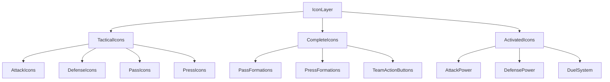
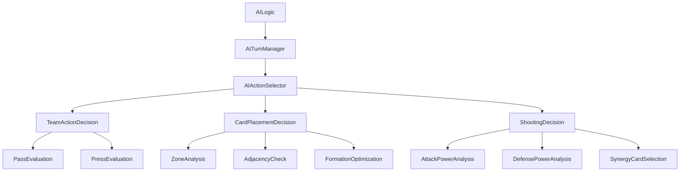

# Football Miracle 11 - Game Objects Mind Map

## Game Architecture Overview

## Detailed Object Relationships

### 1. Game State Management

### 2. Field and Card System

### 3. Game Flow Control

### 4. UI Component Hierarchy

### 5. Icon System Architecture

### 6. AI Decision System

## Object Relationships Summary

### Core Relationships

1. **GameState** is the central object that manages all game data
2. **TurnPhaseService** controls the flow between game phases
3. **FieldIcons** acts as intermediary between player cards and team actions
4. **CardPlacementService** validates card placement rules
5. **AILogic** handles AI decision making
6. **GameBoard** coordinates all UI components

### Data Flow

1. **Player Actions** → **GameState Updates** → **UI Updates**
2. **Card Placement** → **FieldIcons Calculation** → **Team Action Options**
3. **Turn End** → **TurnPhaseService** → **Next Phase**
4. **Shooting** → **DuelSystem** → **GameState Updates**

### Key Dependencies

1. **FieldIcons** depends on **PlayerField** for icon calculations
2. **TeamActionButtons** depends on **FieldIcons** for complete icon counts
3. **GameLogic** depends on **GameState** for state management
4. **UI Components** depend on **GameState** for data display
5. **AILogic** depends on **GameState** for decision making

## System Architecture Principles

1. **State-Driven**: All game logic is driven by GameState
2. **Separation of Concerns**: UI, game logic, and services are separate
3. **Modular Design**: Components and services are modular and reusable
4. **Clear Data Flow**: Unidirectional data flow from actions to state to UI
5. **Intermediary Layers**: Use of intermediary layers like FieldIcons for complex calculations

This architecture provides a solid foundation for the game, allowing for easy extension and maintenance as new features are added.